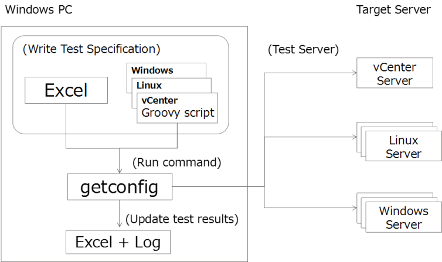

Server construction evidence collector
======================================

System overview
---------------


Collect system configuration information of servers constructed with VMWare virtualization infrastructure.
The system configuration is as follows.



Requirements
------------

**Test server**

* VCenter, Linux requires an environment that allows ssh connection with an examination account from an examination PC.
* Windows requires WMF 4.0 or later for PowerShell.
  Windows 2012 Server R2 is already installed.
  Windows 2012 Server, Windows 2008 Server requires WMF 4.0 installation.
* Remote access permission setting of PowerShell is required.

For details, please refer to **Usage**.

**Examination PC**

* JDK 1.8
* WFM 4.0 or later (for Windows inspection)
* VMWare vSphere client and PowerCLI 5.5 or later (for vCenter inspection)
* 7-zip(zip utility)、UTF-8 editor(Notepad ++, etc.)
* Excel 2007 or later

Build
-----

Clone the repository from the GitHub site and execute the following Gradle task.

**Note** If you need the English version, Modify the line in the 'build.grade',
 Please change to def language = 'en'.

```
cd gradle-server-acceptance
gradle test
gradle zipApp
```

When executed, the following archive file is generated.

```
ls build/distributions
gradle-server-acceptance-0.1.7.zip
```

Usage
-----

1. Extract gradle-server-acceptance-0.1.7.zip.
2. Open "check_sheet.xlsx" and fill out the connection information of the server in the sheet "Target".
3. Edit the server account information in "config/config.groovy".
4. Go to the "server-acceptance" directory and execute getconfig as follows.

```
usage: getconfig -c ./config/config.groovy
 -c,--config <config.groovy>             Config file path
 -d,--dry-run                            Enable Dry run test
    --decode <config.groovy-encrypted>   Decode config file
    --encode <config.groovy>             Encode config file
    --excel <check_sheet.xlsx>           Excel sheet path
 -g,--generate </work/project>           Generate project directory
 -h,--help                               Print usage
 -i,--input <test_servers.groovy>        Target server config script
 -k,--keyword <password>                 Config file password
    --parallel <arg>                     Degree of test runner processes
 -r,--resource <arg>                     Dry run test resource directory
 -s,--server <svr1,svr2,...>             Filtering list of servers
 -t,--test <vm,cpu,...>                  Filtering list of test_ids
 -u,--update <local|db|db-all>           Update node config
    --verify                             Disable verify test
 -x,--xport </work/project.zip>          Export project zip file
```

CMDB registration
-----------------

Register test results in MySQL.
Prepare the MySQL instance with the following command.
(the character set to 'utfmb4')

```
CREATE DATABASE cmdb DEFAULT CHARSET utf8mb4;
```

Edit the JDBC connection settings in config/cmdb.groovy.

Register the test result with the following procedure after test.

```
getconfig -u db
```

Reference
---------

* [Groovy SSH](https://github.com/int128/groovy-ssh)
* [Apache POI](https://poi.apache.org/)
* [PowerShell](https://github.com/PowerShell/PowerShell)
* [PowerCLI](https://www.vmware.com/support/developer/PowerCLI/)

AUTHOR
-----------

Minoru Furusawa <minoru.furusawa@toshiba.co.jp>

COPYRIGHT
-----------

Copyright 2014-2017, Minoru Furusawa, Toshiba corporation.
